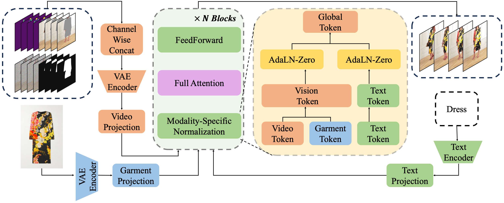

# 1-2-1
1-2-1: Renaissance of Single-Network Paradigm for Virtual Try-On

[Shuliang Ning](https://ningshuliang.github.io/),
[Yipeng Qin](https://profiles.cardiff.ac.uk/staff/qiny16),
[Xiaoguang Han#](https://gaplab.cuhk.edu.cn/)

<a href='https://ningshuliang.github.io/2023/Arxiv/index.html'></a> <a href=''></a> [](https://www.youtube.com/watch?v=jr7wSOsZOoo)


<!-- ## TODO :triangular_flag_on_post:

- [ ] Provide the generation trial on [ModelScope's 3D Object Generation](https://modelscope.cn/studios/Damo_XR_Lab/3D_AIGC/summary)
- [ ] Text to ND Diffusion Model
- [ ] Multiview-ND and Multiview-Albedo Diffusion Models
- [ ] Release code (The code will be public around the end of Dec.2023.) -->

<!-- ## Updates
- **`2024/12/26`**: Our [**Inference Code**](https://github.com/Zheng-Chong/CatVTON/blob/main/inference.py) and [**Weights** 🤗](https://huggingface.co/zhengchong/CatVTON) are released.

- **`2024/12/26`**: Our [**Paper on ArXiv**](http://arxiv.org/abs/2407.15886) is available 🥳! -->
<!-- 
## To do list
- **`TBD`**: Release the training code. -->

<!-- ## Install

```
- System requirement: Ubuntu20.04
- Tested GPUs: A100 40G.
- Cuda 11.7
```

Install requirements using following scripts.

~~~
git clone https://github.com/ningshuliang/PICTURE.git
conda create -n picture
conda activate picture
pip install -r requirements.txt
~~~

Download the pretrained weights [baiduyun](https://pan.baidu.com/s/1J-KC9n8HGX7yXnI-jk8zZA?pwd=qpky) or [Hugging Face ](https://huggingface.co/Shuliang/PICTURE/tree/main/pretrain_models) and place it in the pretrain_models directory.

## Stage 1

~~~
cd Stage1_Text_to_Parsing
bash test.sh
~~~

## Stage 2

~~~
cd Stage2_Parsing_to_Image
bash test.sh
~~~ -->


## Architecture



## Experiments


## More video results are shown in project page. 